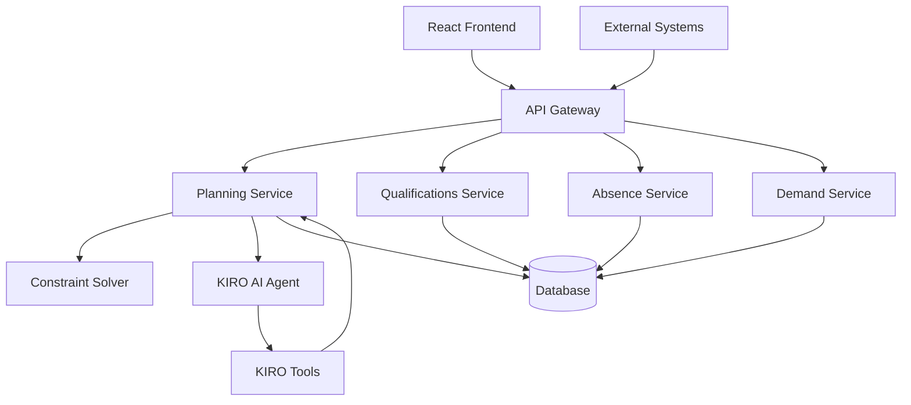

# ShiftWise Design Document

## Overview

ShiftWise is an AI-assisted workforce planning system that automates shift scheduling for production environments. The system uses constraint-based optimization to generate staffing proposals while ensuring compliance with labor laws, skill requirements, and operational constraints. The architecture follows a microservices pattern with a React frontend, Node.js backend services, and an AI layer integrated with KIRO's agent capabilities.

## Architecture

### High-Level Architecture



### Service Architecture

**Frontend Layer (React/TypeScript)**
- Planning Board: Interactive calendar with drag-drop assignment capabilities
- Coverage Dashboard: Real-time heatmaps and gap visualization
- Qualification Matrix: Employee skills management interface
- Assistant Panel: AI interaction and explanation display

**API Layer (Node.js/Express)**
- RESTful endpoints for all CRUD operations
- Authentication middleware with OIDC integration
- Role-based access control enforcement
- Request validation and error handling

**Business Logic Layer**
- Planning Service: Core scheduling logic and constraint orchestration
- Qualifications Service: Employee skills and certification management
- Absence Service: Vacation, sick leave, and availability tracking
- Demand Service: Shift requirements and station configuration

**AI Integration Layer**
- KIRO Agent Tools: Natural language planning commands
- Explanation Engine: Assignment reasoning and justification
- Simulation Engine: What-if scenario processing

**Data Layer**
- Primary Database: PostgreSQL for production, SQLite for development
- Audit Log: Immutable event store for all planning decisions
- Cache Layer: Redis for frequently accessed data

## Components and Interfaces

### Core Services

#### Planning Service
```typescript
interface PlanningService {
  generatePlan(request: PlanGenerationRequest): Promise<PlanProposal>
  commitPlan(planId: string, assignments: Assignment[]): Promise<CommitResult>
  simulateScenario(scenario: WhatIfScenario): Promise<SimulationResult>
  explainAssignment(assignmentId: string): Promise<AssignmentExplanation>
}

interface PlanGenerationRequest {
  dateRange: DateRange
  stationIds?: string[]
  shiftTemplateIds?: string[]
  strategy?: PlanningStrategy
  constraints?: CustomConstraint[]
}
```

#### Constraint Solver
```typescript
interface ConstraintSolver {
  solve(problem: SchedulingProblem): Promise<SolutionResult>
  validateConstraints(assignments: Assignment[]): Promise<ConstraintViolation[]>
  optimizeAssignments(assignments: Assignment[], objectives: Objective[]): Promise<Assignment[]>
}

interface SchedulingProblem {
  demands: ShiftDemand[]
  employees: Employee[]
  constraints: Constraint[]
  objectives: Objective[]
}
```

#### KIRO AI Tools
```typescript
interface KiroTools {
  generatePlan(params: GeneratePlanParams): Promise<PlanResult>
  explainPlan(planId: string): Promise<string>
  simulateAbsence(employeeId: string, dates: DateRange): Promise<ImpactAnalysis>
  suggestOptimizations(planId: string): Promise<OptimizationSuggestion[]>
}
```

### Frontend Components

#### Planning Board
- Calendar view with station columns and shift rows
- Drag-and-drop assignment interface
- Real-time constraint validation
- Coverage status indicators

#### Coverage Dashboard
- Heatmap visualization (green/yellow/red coverage levels)
- Gap list with criticality rankings
- Trend analysis and forecasting
- Alert notifications for critical shortages

#### AI Assistant Panel
- Natural language command input
- Explanation display for assignments
- What-if scenario controls
- Optimization suggestions

## Data Models

### Core Entities

```typescript
interface Employee {
  id: string
  name: string
  contractType: ContractType
  weeklyHours: number
  maxHoursPerDay: number
  minRestHours: number
  team: string
  active: boolean
  preferences?: EmployeePreferences
}

interface Skill {
  id: string
  name: string
  description?: string
  levelScale: number // 1-3
  category: SkillCategory
}

interface EmployeeSkill {
  employeeId: string
  skillId: string
  level: number
  validUntil?: Date
  certificationId?: string
}

interface ShiftTemplate {
  id: string
  name: string
  startTime: string
  endTime: string
  breakRules: BreakRule[]
  shiftType: ShiftType
}

interface Station {
  id: string
  name: string
  line: string
  requiredSkills: RequiredSkill[]
  priority: Priority
  location?: string
}

interface RequiredSkill {
  skillId: string
  minLevel: number
  count: number
  mandatory: boolean
}

interface ShiftDemand {
  id: string
  date: Date
  stationId: string
  shiftTemplateId: string
  requiredCount: number
  priority: Priority
  notes?: string
}

interface Assignment {
  id: string
  demandId: string
  employeeId: string
  status: AssignmentStatus // 'proposed' | 'confirmed' | 'rejected'
  score: number
  explanation?: string
  createdAt: Date
  createdBy: string
}

interface Absence {
  id: string
  employeeId: string
  type: AbsenceType // 'vacation' | 'sick' | 'training' | 'personal'
  dateStart: Date
  dateEnd: Date
  approved: boolean
  approvedBy?: string
  reason?: string
}
```

### Constraint System

```typescript
interface Constraint {
  id: string
  name: string
  type: ConstraintType // 'hard' | 'soft'
  priority: number
  validator: ConstraintValidator
}

interface ConstraintViolation {
  constraintId: string
  severity: Severity
  message: string
  affectedAssignments: string[]
  suggestedActions: string[]
}
```

## Error Handling

### Error Categories

**Validation Errors**
- Invalid input parameters
- Business rule violations
- Data consistency issues

**Constraint Violations**
- Hard constraint failures (blocking)
- Soft constraint warnings (optimization)
- Compliance violations

**System Errors**
- Database connectivity issues
- External service failures
- Performance timeouts

### Error Response Format

```typescript
interface ErrorResponse {
  error: {
    code: string
    message: string
    details?: any
    timestamp: Date
    requestId: string
  }
}
```

### Error Handling Strategy

1. **Input Validation**: Validate all inputs at API boundaries
2. **Graceful Degradation**: Provide partial results when possible
3. **User-Friendly Messages**: Translate technical errors to actionable user guidance
4. **Logging**: Comprehensive error logging for debugging and monitoring
5. **Retry Logic**: Automatic retry for transient failures

## Testing Strategy

### Unit Testing
- **Services**: Test business logic with mocked dependencies
- **Constraints**: Validate each constraint rule independently
- **Utilities**: Test helper functions and data transformations
- **Components**: Test React components with React Testing Library

### Integration Testing
- **API Endpoints**: Test complete request/response cycles
- **Database Operations**: Test data persistence and retrieval
- **Constraint Solver**: Test end-to-end constraint satisfaction
- **KIRO Tools**: Test AI agent integration

### End-to-End Testing
- **User Workflows**: Test complete planning scenarios
- **Cross-Service Communication**: Validate service interactions
- **Performance**: Load testing with realistic data volumes
- **Security**: Authentication and authorization testing

### Test Data Strategy
- **Seed Data**: Consistent test datasets for development
- **Factories**: Generate test data with realistic relationships
- **Scenarios**: Pre-built test scenarios for common use cases
- **Edge Cases**: Test boundary conditions and error scenarios

### Performance Testing
- **Load Testing**: 200 employees, 10 stations, multiple shifts
- **Stress Testing**: Peak usage scenarios
- **Constraint Solver Performance**: Sub-3-second generation requirement
- **Database Performance**: Query optimization and indexing

### Security Testing
- **Authentication**: OIDC integration testing
- **Authorization**: Role-based access control validation
- **Data Protection**: GDPR compliance verification
- **Audit Trail**: Complete traceability testing

## Implementation Approach

### Constraint Solving Algorithm

**Phase 1: Greedy Assignment**
1. Sort demands by priority and criticality
2. For each demand, find qualified available employees
3. Score candidates based on fairness, preferences, and continuity
4. Assign highest-scoring candidate
5. Update employee availability and workload

**Phase 2: Optimization**
1. Identify suboptimal assignments
2. Attempt beneficial swaps within constraints
3. Apply local search improvements
4. Validate all constraints remain satisfied

**Phase 3: Gap Analysis**
1. Identify unfilled demands
2. Rank gaps by business impact
3. Suggest mitigation strategies
4. Generate alternative scenarios

### AI Integration Strategy

**Natural Language Processing**
- Command parsing for planning requests
- Intent recognition for user queries
- Context-aware response generation

**Explanation Generation**
- Rule-based explanation templates
- Dynamic reasoning chain construction
- User-friendly language translation

**Learning and Adaptation**
- Pattern recognition in planning decisions
- Preference learning from user feedback
- Continuous improvement of scoring functions

### Scalability Considerations

**Horizontal Scaling**
- Stateless service design
- Load balancer distribution
- Database read replicas

**Caching Strategy**
- Employee qualification caching
- Constraint rule caching
- Frequently accessed plan caching

**Performance Optimization**
- Database indexing strategy
- Query optimization
- Asynchronous processing for long-running operations

### Security and Compliance

**Data Protection**
- Minimal personal data storage
- Encryption at rest and in transit
- Regular data purging policies

**Access Control**
- Role-based permissions
- API rate limiting
- Audit logging for all operations

**GDPR Compliance**
- Data subject rights implementation
- Consent management
- Data portability features